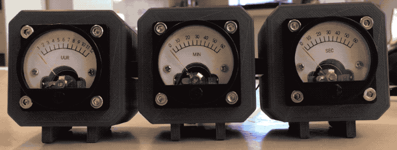

# Analog Volt Clock

An Arduino Volt Meter Analog Clock based on a TinyRTC real time clock.

For more info about this project, check out my blog for the full story
images, and the end result of the project:
http://michaelteeuw.nl/post/174972004187/what-time-is-it-fathers-day

## PLATFORM IO

This is a [PlatformIO](http://platformio.org) project. By using PlatformIO, all nessecery dependencies
will be installed automatically.

## LICENSE
Permission is hereby granted, free of charge, to any person
obtaining a copy of this software and associated documentation files
(the "Software"). For more info see [LICENSE](https://github.com/MichMich/AnalogVoltMeterClock/blob/master/LICENSE).

## CONNECTIONS

### TinyRTC
* GND > Arduino GND
* VCC > Arduino 5V
* SDA > Arduino A4
* SCL > Arduino A5

### Button Adjust Hour
* [] > Arduino D7
* [] > Arduino GND

### Button Adjust Minute
* [] > Arduino D8
* [] > Arduino GND

### Meter HOURS
* [-] > Arduino GND
* [+] > Arduino D3

### Meter MINUTES
* [-] > Arduino GND
* [+] > Arduino D5

### Meter SECONDS
* [-] > Arduino GND
* [+] > Arduino D6

### Meter LEDS
All LEDs are connected in parallel, with one 33 Ohm resistor.

* LEDS [+] > RESISTOR > Arduino 5V
* LEDS [-] > Arduino GND
